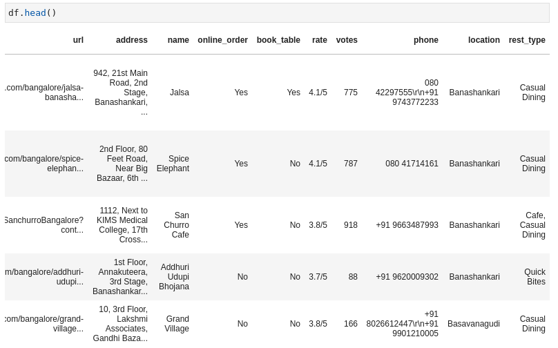
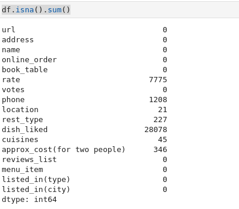
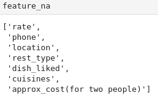
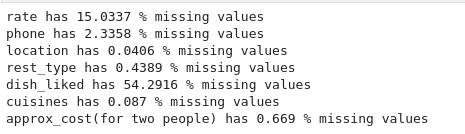
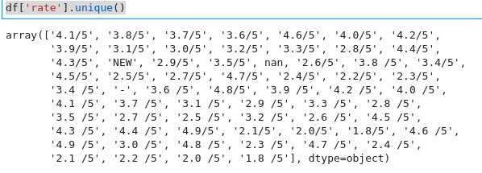
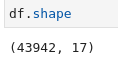
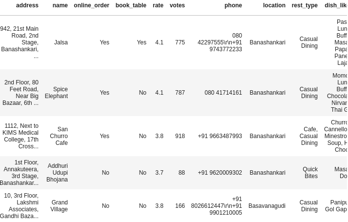

# Project 3 Geospatial Analysis Project

# a.- Preprocesamiento de datos para el análisis

# 0. INFO  del dataset

Columns description
1.url contains the url of the restaurant in the zomato website

2.address contains the address of the restaurant in Bengaluru

3.name contains the name of the restaurant

4.online_order whether online ordering is available in the restaurant or not

5.book_table table book option available or not

6.rate contains the overall rating of the restaurant out of 5

7.votes contains total number of rating for the restaurant as of the above mentioned date

8.phone contains the phone number of the restaurant

9.location contains the neighborhood in which the restaurant is located

10.rest_type restaurant type

11.dish_liked dishes people liked in the restaurant

12.cuisines food styles, separated by comma

13.approx_cost(for two people) contains the approximate cost for meal for two people

14.reviews_list list of tuples containing reviews for the restaurant, each tuple

15.menu_item contains list of menus available in the restaurant

16.listed_in(type) type of meal

17.listed_in(city) contains the neighborhood in which the restaurant is listed20. [Enlaces ](#schema20)

# 1. Importar librerías y cargar los datos
~~~python
import pandas as pd
import numpy as np
import matplotlib.pyplot as plt
import seaborn as sns
df=pd.read_csv('./data/zomato.csv')
~~~

# 2. Limpiar el data set
~~~pyhton
df.shape
df.dtypes
len(df['name'].unique())
df.isna().sum()
~~~
Tenemos `51717`datos en `17`
Todos los datos on `objects`
Los nombres diferences son `8792`
Los nulos 

# 3. Obtener las datos con NAN
~~~python
feature_na=[feature for feature in df.columns if df[feature].isnull().sum()>0]
~~~

~~~python
for feature in feature_na:
    print('{} has {} % missing values'.format(feature,np.round(df[feature].isnull().sum()/len(df)*100,4)))
~~~

Comprobamos que la columna con mas valores nulos es la `rate`

# 4. Vamos a modificar la columna rate, quitandole los nulos y variando su formatos
~~~python
df['rate'].unique()
~~~

~~~python
df.dropna(axis='index',subset=['rate'],inplace=True)
~~~
Al eliminar los nulos de rate son quedamos con estos datos:

Para variar el formato de la columna creamos una función:
~~~python
def split(x):
    return x.split('/')[0]
df['rate']=df['rate'].apply(split)    
~~~

Después remplazamos los valores que contengan `NEW` y `-` por ceros y convertimos todos los valores a`float `
~~~python
df.replace('NEW',0,inplace=True)
df.replace('-',0,inplace=True)
df['rate']=df['rate'].astype(float)
~~~
# Project-3-Geospatial-Analysis-Project
