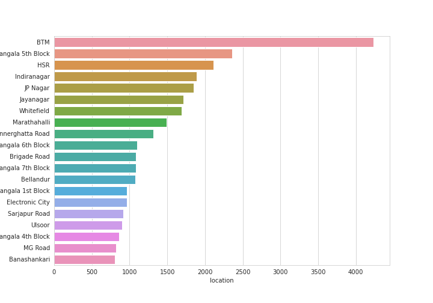
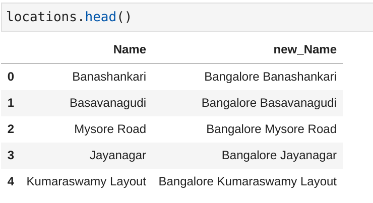
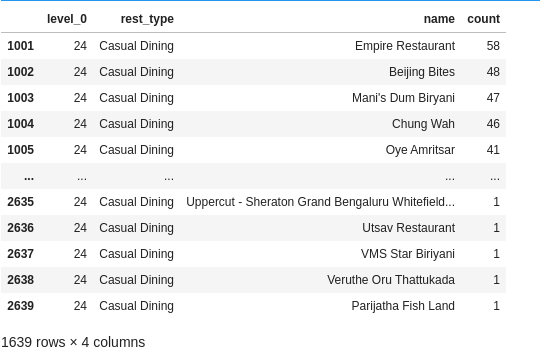

# Project 3 Geospatial Analysis Project

0. [INFO  del dataset](#schema0)
# a.- Preprocesamiento de datos para el análisis
1. [Importar librerías y cargar los datos](#schema1)
2. [Limpiar el data set](#schema2)
3. [Obtener las datos con NAN](#schema3)
4. [Vamos a modificar la columna rate, quitandole los nulos y variando su formatos](#schema4)

# b.- Análisis en profundidad de los restaurantes
5. [Calcular la calificación promedio de cada restaurante](#schema5)
6. [Dibujar la distribución del rating](#schema6)
7. [¿Cuáles son las principales cadenas de restaurantes en Bangalore?](#schema7)
8. [¿Cuántos de los restaurantes no aceptan pedidos online?](#schema8)

# c.- Análsis del mejor restaurante
9. [¿Cuál es la relación entre restaurantes que ofrecen y no ofrecen reserva de mesa?](#schema9)
10. [Limpiamos los datos](#schema10)
11. [Los restaurantes mas votados y total de restaurantes en diferentes ubicaciones de Bangalore](#schema11)
12. [Número total de variedad de restaurantes, es decir, norte de la India, sur de la India](#schema12)
13. [Analizar costo aproximado para 2 personas](#schema13)
14. [Gasto vs rating](#schema14)
15. [¿Hay alguna diferencia entre los votos de los restaurantes que aceptan y no aceptan pedidos en línea?](#schema15)

# d.-  Análisis de los precios de los restaruantes 
16. [¿Existe alguna diferencia entre el precio y el precio de los restaurantes que aceptan y no aceptan pedidos en línea?](#schema16)
17. [Encontrar los restaurantes más lujosos](#schema17)
18. [Top ten de restaurantes](#schema18)
19. [Todos los restaurantes que están por debajo de 500 ](#schema19)

# e.- Análisis del restaurante
20. [Restaurantes que tienen una mejor calificación> 4 y que también están por debajo del presupuesto](#schema20)
21. [Total de varios hoteles asequibles en diferentes ubicaciones](#schema21)
22. [Encontrar los mejores restaurantes económicos en cualquier lugar](#schema22)

# f.- Análisis geográfico
23. [Análisis geográfico](#schema23)
# g.- Análisis del mas populares cocinas 
24. [¿Cuáles son las cadenas de restaurantes de comida informal más populares?](#schema24)

# 0. INFO  del dataset

Columns description
1.url contains the url of the restaurant in the zomato website

2.address contains the address of the restaurant in Bengaluru

3.name contains the name of the restaurant

4.online_order whether online ordering is available in the restaurant or not

5.book_table table book option available or not

6.rate contains the overall rating of the restaurant out of 5

7.votes contains total number of rating for the restaurant as of the above mentioned date

8.phone contains the phone number of the restaurant

9.location contains the neighborhood in which the restaurant is located

10.rest_type restaurant type

11.dish_liked dishes people liked in the restaurant

12.cuisines food styles, separated by comma

13.approx_cost(for two people) contains the approximate cost for meal for two people

14.reviews_list list of tuples containing reviews for the restaurant, each tuple

15.menu_item contains list of menus available in the restaurant

16.listed_in(type) type of meal

17.listed_in(city) contains the neighborhood in which the restaurant is listed20. [Enlaces ](#schema20)

# 1. Importar librerías y cargar los datos
~~~python
import pandas as pd
import numpy as np
import matplotlib.pyplot as plt
import seaborn as sns
df=pd.read_csv('./data/zomato.csv')
~~~

# 2. Limpiar el data set 
~~~pyhton
df.shape
df.dtypes
len(df['name'].unique())
df.isna().sum()
~~~
Tenemos `51717`datos en `17`
Todos los datos on `objects`
Los nombres diferences son `8792`
Los nulos 

# 3. Obtener las datos con NAN
~~~python
feature_na=[feature for feature in df.columns if df[feature].isnull().sum()>0]
~~~

~~~python
for feature in feature_na:
    print('{} has {} % missing values'.format(feature,np.round(df[feature].isnull().sum()/len(df)*100,4)))
~~~

Comprobamos que la columna con mas valores nulos es la `rate`

# 4. Vamos a modificar la columna rate, quitandole los nulos y variando su formatos
~~~python
df['rate'].unique()
~~~

~~~python
df.dropna(axis='index',subset=['rate'],inplace=True)
~~~
Al eliminar los nulos de rate son quedamos con estos datos:

Para variar el formato de la columna creamos una función:
~~~python
def split(x):
    return x.split('/')[0]
df['rate']=df['rate'].apply(split)    
~~~

Después remplazamos los valores que contengan `NEW` y `-` por ceros y convertimos todos los valores a`float `
~~~python
df.replace('NEW',0,inplace=True)
df.replace('-',0,inplace=True)
df['rate']=df['rate'].astype(float)
~~~

# 5 . Calcular la calificación promedio de cada restaurante
Agrupamos por nombre y hacemos la media del `rate` y mostramos los 20 mejores

~~~python
df.groupby('name')['rate'].mean().nlargest(20).plot.bar()
plt.savefig("./images/name.png")
~~~

~~~python
df_rate=df.groupby('name')['rate'].mean().to_frame()
df_rate=df_rate.reset_index()
df_rate.columns=['restaurant','rating']
df_rate.head(20)
~~~

# 6. Dibujar la distribución del rating
~~~python
sns.set_style(style='whitegrid')
sns.distplot(df_rate['rating'])
~~~

Casi más del 50 por ciento de los restaurantes tienen una calificación de entre 3 y 4. Los restaurantes con una calificación de más de 4.5 son muy raros.

# 7 .¿Cuáles son las principales cadenas de restaurantes en Bangalore?
~~~python
plt.figure(figsize=(10,7))
chains=df['name'].value_counts()[0:20]
sns.barplot(x=chains,y=chains.index,palette='deep')
plt.title("Most famous restaurants chains in Bangaluru")
plt.xlabel("Number of outlets") 
~~~

# 8. ¿Cuántos de los restaurantes no aceptan pedidos online?
~~~python
x=df['online_order'].value_counts()
labels=['accepted','not accepted']
plt.pie(x,explode=[0.0,0.1],autopct='%1.1f%%')
~~~

# 9. ¿Cuál es la relación entre restaurantes que ofrecen y no ofrecen reserva de mesa?
~~~python
x=df['book_table'].value_counts()
labels=['not book','book']
plt.pie(x,explode=[0.0,0.1],autopct='%1.1f%%')
~~~

# 10. Limpiamos los datos

~~~python
df['rest_type'].isna().sum()
df['rest_type'].dropna(inplace=True)
plt.figure(figsize=(20,12))
df['rest_type'].value_counts().nlargest(20).plot.bar(color='red')
plt.gcf().autofmt_xdate()
plt.savefig("./images/rest_type.png")
~~~

# 11. Los restaurantes mas votados y total de restaurantes en diferentes ubicaciones de Bangalore
~~~python
df.groupby('name')['votes'].max().nlargest(10).plot.bar()
plt.savefig("./images/votes.png")
~~~

~~~python
df.groupby('location')['name'].unique()
~~~

Creamos un diccionario con las localizaciones y la cantidad de resturantes. 
~~~python
restaurant=[]
location=[]
for key,location_df in df.groupby('location'):
    location.append(key)
    restaurant.append(len(location_df['name'].unique()))
df_total=pd.DataFrame(zip(location,restaurant))
df_total.columns=['location','restaurant']
df_total.set_index('location',inplace=True)
df_total.sort_values(by='restaurant').tail(10)
~~~

~~~python
df_total.sort_values(by='restaurant').tail(10).plot.bar()
plt.savefig("./images/sort_rest.png")
~~~

# 12. Número total de variedad de restaurantes, es decir, norte de la India, sur de la India
~~~python
cuisines=df['cuisines'].value_counts()[:10]
sns.barplot(cuisines,cuisines.index)
plt.xlabel('Count')
plt.title("Most popular cuisines of Bangalore")
~~~

Comprobamos que la mayor variedad de restaurantes son `North India` y `North India Chinese`

# 13. Analizar costo aproximado para 2 personas

Comprobamos si hay nulos, y si los hay los eliminamos.

~~~python
df["approx_cost(for two people)"].isna().sum()
~~~

~~~python
df.dropna(axis='index',subset=['approx_cost(for two people)'],inplace=True)
~~~
Como los dastos son `object` los converitmos a `int`, primero les quitamos las comas y después los pasamos a `int`. Los podemos pasar a `int` porque hemos comprobado que no hay ningún dato tenga decimales.

~~~python

df['approx_cost(for two people)'] = df['approx_cost(for two people)'].apply(lambda x: x.replace(',',''))
df['approx_cost(for two people)']=df['approx_cost(for two people)'].astype(int)
~~~

# 14.  Gasto vs rating

~~~python
plt.figure(figsize=(10,7))
sns.scatterplot(x="rate",y='approx_cost(for two people)',hue='online_order',data=df)
plt.show()

~~~
A partir de este diagrama de dispersión, podemos llegar a la conclusión de que la mayoría de las personas con las calificaciones más altas aceptan pedidos en línea y también están presupuestados.

# 15. ¿Hay alguna diferencia entre los votos de los restaurantes que aceptan y no aceptan pedidos en línea?

~~~python
sns.boxplot(x='online_order',y='votes',data=df)
~~~

A partir de este diagrama de caja, podemos observar que la mediana del número de votos para ambas categorías varía.
Los restaurantes que aceptan pedidos en línea obtienen más votos de los clientes, ya que hay una opción de calificación que aparece después de cada pedido a través de la aplicación zomato.

# 16 . ¿Existe alguna diferencia entre el precio y el precio de los restaurantes que aceptan y no aceptan pedidos en línea?
~~~python
sns.boxplot(x='online_order',y='approx_cost(for two people)',data=df)
~~~

Los restaurantes que aceptan pedidos en línea son más asequibles que los restaurantes que no aceptan pedidos en línea

# 17. Encontrar los restaurantes más lujosos
~~~python
df['approx_cost(for two people)'].min()
df['approx_cost(for two people)'].max()
~~~
El mínimo es `40` y el máximo es `6000`

~~~python
df[df['approx_cost(for two people)']==6000]["name"]
~~~

Hay solo dos restaruantes 

# 18. Top ten de restaurantes
Hacemos una copia de los datos y ponemos de índice a la columna `name`
~~~python
data = df.copy()
data.set_index('name',inplace=True)
~~~

Los 10 restaurantes más baratos con un costo aproximado para 2 personas
~~~python
data['approx_cost(for two people)'].nsmallest(10)
data['approx_cost(for two people)'].nsmallest(10).plot.bar()
plt.savefig("./images/cheap.png")
~~~

Los 10 restaurantes más baratos en cuanto a ubicación con un costo aproximado para 2 personas
~~~python
data.set_index('location',inplace=True)
data['approx_cost(for two people)'].nsmallest(10)
data['approx_cost(for two people)'].nsmallest(10).plot.bar()
~~~

Los 10 restaurantes más caros con un costo aproximado para 2 personas

~~~python
data_e['approx_cost(for two people)'].nlargest(10).plot.bar()
plt.savefig("./images/expens.png")
~~~

# 19. Todos los restaurantes que están por debajo de 500 
~~~python
data_e[data_e['approx_cost(for two people)']<=500]
~~~

~~~python
df_budget=data[data['approx_cost(for two people)']<=500].loc[:,('approx_cost(for two people)')]
df_budget=df_budget.reset_index()
df_budget.head()
~~~

~~~python
df_budget['approx_cost(for two people)'].value_counts().plot.bar()
~~~

# 20. Restaurantes que tienen una mejor calificación> 4 y que también están por debajo del presupuesto

nº total. de los restaurantes que tienen una mejor calificación> 4 y que también están por debajo del presupuesto, es decir, menos de 500

~~~python
df[(df['rate']>=4) & (df['approx_cost(for two people)']<=500)].shape
df_new=df[(df['rate']>=4) & (df['approx_cost(for two people)']<=500)]
len(df_new['name'].unique())
~~~
Nos quedamos con 628 restaurantes que lo cumplen.

# 21 .- Total de varios hoteles asequibles en diferentes ubicaciones

~~~python
location=[]
total=[]
for loc,location_df in df_new.groupby('location'):
    location.append(loc)
    total.append(len(location_df['name'].unique()))
location_df=pd.DataFrame(zip(location,total))
location_df.columns=['location','restaurant']
location_df.set_index('location',inplace=True)
~~~

~~~python
location_df['restaurant'].nlargest(10).plot.bar()
plt.gcf().autofmt_xdate()
plt.ylabel('Total restaurants')
plt.savefig("./images/total_rest.png")
~~~

# 22 .- Encontrar los mejores restaurantes económicos en cualquier lugar

~~~python
def return_budget(location,restaurant):
    budget=df[(df['approx_cost(for two people)']<=400) & (df['location']==location) & 
                     (df['rate']>4) & (df['rest_type']==restaurant)]
    return(budget['name'].unique())
plt.figure(figsize=(10,7))
Restaurant_locations=df['location'].value_counts()[:20]
sns.barplot(Restaurant_locations,Restaurant_locations.index)
plt.savefig("./images/loc.png")
~~~

# 23 .- análisis geográfico

Necesito Latitudes y longitudes para cada lugar para el análisis de datos geográficos, así que para obtener lat, lon de cada lugar, use Geopy

~~~python
locations=pd.DataFrame({"Name":df['location'].unique()})
locations['new_Name']='Bangalore '+locations['Name']
~~~

Importamos y recorriendo los valores de `locations`obtenemos los valores de logitud y latitud
~~~python
from geopy.geocoders import Nominatim

lat_lon=[]
geolocator=Nominatim(user_agent="app")
for location in locations['Name']:
    location = geolocator.geocode(location, timeout = 10000)
    if location is None:
        lat_lon.append(np.nan)
    else:    
        geo=(location.latitude,location.longitude)
        lat_lon.append(geo)

locations['geo_loc']=lat_lon
~~~

Creamos el dataframe 
~~~python
Rest_locations=pd.DataFrame(df['location'].value_counts().reset_index())
Rest_locations.columns=['Name','count']
Restaurant_locations=Rest_locations.merge(locations,on='Name',how="left").dropna()
~~~

Separamos los valores de la longitud y latitud
~~~python
lat,lon=zip(*np.array(Restaurant_locations['geo_loc']))
Restaurant_locations['lat']=lat
Restaurant_locations['lon']=lon
~~~

Como ya no vamos a necesitar la columna `geo_loc` la borramos
~~~python

Restaurant_locations.drop("geo_loc", axis = 1, inplace = True)
~~~

Instalamos folium,  importamos y generamos un mapa base
~~~python
import folium
from folium.plugins import HeatMap
basemap=generateBaseMap()
~~~

Creamos la función `generateBaseMap` genera el mapa base
~~~python
def generateBaseMap(default_location=[12.97, 77.59], default_zoom_start=12):
    base_map = folium.Map(location=default_location, zoom_start=default_zoom_start)
    return base_map
~~~
Creamos un `heatmap`
~~~python
HeatMap(Restaurant_locations[['lat','lon','count']].values.tolist(),zoom=20,radius=15).add_to(basemap)
~~~

# 24. ¿Cuáles son las cadenas de restaurantes de comida informal más populares?
~~~python
df_1=df.groupby(['rest_type','name']).agg('count')
datas=df_1.sort_values(['url'],ascending=False).groupby(['rest_type'],
                as_index=False).apply(lambda x : x.sort_values(by="url",ascending=False).head(3))['url'].reset_index().rename(columns={'url':'count'})
~~~

~~~python
casual=dataset[dataset['rest_type']=='Casual Dining']
~~~

